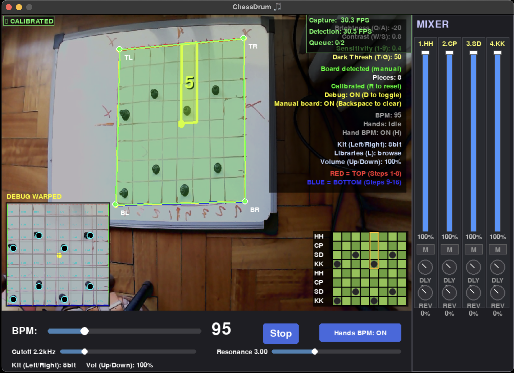

# ChessDrum 🎵♟️

A drum sequencer where an 8x8 chessboard controls a 4-instrument, 16-step drum pattern. Place pieces on the board to create beats!


*Camera mode with board detection, overlay, and real-time controls.*

## ✨ Highlights

- Manual board calibration (4 clicks) with debug warped view
- Two open hands to control BPM, single hand does not change tempo
- Six built-in sound kits (classic, real, dnb, ethnic, 8bit, bizarre)
- Sound + pattern libraries (JSON) with in-app browser (press L)
- Real-time detection tuning (sensitivity/threshold/brightness/contrast)
- Audio synth filter + MIDI output option

## 🎮 How It Works

```
┌─────────────────────────────────────┐
│           8x8 CHESSBOARD            │
├─────────────────────────────────────┤
│  Row 0-3: Steps 1-8   (Bar 1)      │
│  Row 4-7: Steps 9-16  (Bar 2)      │
├─────────────────────────────────────┤
│  Each row = 1 instrument:           │
│    Row 0,4 = Hi-Hat                 │
│    Row 1,5 = Clap                   │
│    Row 2,6 = Snare                  │
│    Row 3,7 = Kick                   │
├─────────────────────────────────────┤
│  ⚫ Black piece = hit (velocity 80)  │
│  Empty = silence                    │
│  (Uses BLACK pieces for contrast)   │
└─────────────────────────────────────┘
```

## 🚀 Quick Start

```bash
# Install dependencies
pip install -r requirements.txt

# Run
python3 src/main.py
```

## 🎛️ Controls

### Basic Controls
| Input | Action |
|-------|--------|
| **Click cell** | Toggle: empty → black → empty |
| **Space** | Play/Stop |
| **C** | Clear board |
| **ESC** | Quit |

### Sound & Filter Controls
| Input | Action |
|-------|--------|
| **← / →** | Previous/next sound kit |
| **↑ / ↓** | Master volume |
| **0** | Reset filter (cutoff/resonance) |
| **L** | Library browser (sound + pattern presets) |
| **H** | Toggle hand BPM detection |

Filter is controlled by the on-screen Cutoff and Resonance sliders (below BPM).
Drag the sliders with the mouse to shape the tone.
Use **H** or the **Hands BPM** button to disable hand BPM while moving pieces.

### Camera Controls (when --camera mode)
| Input | Action |
|-------|--------|
| **Q / A** | Brightness +5 / -5 |
| **W / S** | Contrast +0.1 / -0.1 |
| **E** | Reset brightness/contrast |
| **R** | **Recalibrate board baseline** (use when lighting changes) |
| **D** | **Toggle debug mode** (shows warped board analysis) |
| **M** | **Manual board mode** (click 4 corners: TL,TR,BR,BL) |
| **Backspace** | **Clear manual board** (return to auto detect) |
| **Right click** | **Undo last corner** (manual mode) |
| **1-9** | **Sensitivity** (1=strict, 5=balanced, 9=sensitive) |
| **T / G** | **Dark threshold** +5 / -5 (adjust piece detection) |
| **2 open hands** | **BPM control** (20-220, only when both hands are open and held briefly) |
| **H** | **Hand BPM toggle** (disable hand detection when placing pieces) |

## 🔊 Synth Filter

Use the two sliders under BPM:

- **Cutoff**: Lowpass cutoff frequency (lower = darker, higher = brighter)
- **Resonance**: Boosts the cutoff area for a sharper, more "squelchy" sound

## 🧰 Sound Kits

Switch kits with **← / →** (audio mode only). Available kits:

- **classic**: original synthetic kit (balanced).
- **real**: punchy acoustic-style kit.
- **dnb**: tight, fast drum-and-bass vibe.
- **ethnic**: softer, percussive, more 'organic'.
- **8bit**: chiptune/bitcrushed kit.
- **bizarre**: experimental, noisy, and weird.
- **hybrid_*:** built-in drum kits with HH/CP converted to notes.

All kits are generated in code (no external samples). You can also add your own WAV or synth kits in `libraries/sound_libraries.json`.

## 📚 Pattern Libraries

Pattern presets live in `libraries/pattern_libraries.json` and can be applied from the in-app library browser (press **L**).
Each library can include up to 4 patterns and can optionally pick a sound kit.

Included presets: Chroma C Pulse, D Shuffle, E Steps, F Bounce, G Drive (drums + notes).
See [docs/LIBRARIES.md](docs/LIBRARIES.md) for examples and templates.

### Library Browser

Press **L** to open the browser:

- **Tab** switches between Sound and Pattern lists
- **Up/Down** selects a library
- **Left/Right** switches patterns (pattern mode)
- **Enter** applies the selection

## ⚙️ Configuration

All settings in `config.json`:

```json
{
  "audio": {
    "enabled": true,
    "kit": "classic",
    "sample_rate": 44100,
    "buffer_size": 512,
    "volume": 1.0,
    "channels": 32,
    "instrument_gain": {
      "kick": 1.0,
      "snare": 1.2,
      "hihat": 1.0,
      "clap": 1.0
    }
  },
  "camera": {
    "enabled": false,
    "device_id": 1,
    "brightness": 0,
    "contrast": 1.0,
    "manual_corners": null,
    "hand_bpm_enabled": true,
    "bpm_min_distance": 80,
    "bpm_max_distance": 880,
    "detection_sensitivity": 0.5,
    "dark_threshold": 50
  },
  "midi": {
    "enabled": false,
    "port_name": "ChessDrum"
  },
  "filter": {
    "enabled": true,
    "min_freq": 80,
    "max_freq": 12000,
    "resonance": 3.0
  },
  "sequencer": {
    "default_bpm": 120
  },
  "libraries": {
    "sound_file": "libraries/sound_libraries.json",
    "pattern_file": "libraries/pattern_libraries.json"
  }
}
```

### Options

| Setting | Description |
|---------|-------------|
| `audio.enabled` | Use built-in synth sounds |
| `audio.kit` | Sound kit id from `libraries/sound_libraries.json` (e.g., `classic`, `real`, `hybrid_c_major`) |
| `audio.buffer_size` | Audio buffer size (latency vs stability) |
| `audio.volume` | Master volume (0.0 - 1.0) |
| `audio.channels` | Mixer channels (overlap headroom for longer samples) |
| `audio.instrument_gain` | Per-instrument gain map (`kick`, `snare`, `hihat`, `clap`) |
| `midi.enabled` | Output MIDI to DAW |
| `camera.brightness` | Image brightness offset |
| `camera.contrast` | Image contrast multiplier |
| `camera.manual_corners` | Manual board corners (normalized TL,TR,BR,BL) |
| `camera.hand_bpm_enabled` | Start with hand BPM detection enabled |
| `camera.bpm_min_distance` | Hand distance → minimum BPM |
| `camera.bpm_max_distance` | Hand distance → maximum BPM |
| `filter.min_freq` | Lowest cutoff (Hz) for the Cutoff slider |
| `filter.max_freq` | Highest cutoff (Hz) for the Cutoff slider |
| `filter.resonance` | Default resonance value |
| `libraries.sound_file` | Sound library JSON file |
| `libraries.pattern_file` | Pattern library JSON file |

## 🎹 MIDI Mode

```bash
python3 src/main.py --midi
```

Creates virtual MIDI port "ChessDrum" for your DAW.

| Instrument | MIDI Note |
|------------|-----------|
| Kick | 36 |
| Snare | 38 |
| Clap | 39 |
| Hi-Hat | 42 |

## 📷 Camera Detection Mode

Run with `--camera` flag to use physical chessboard detection:

```bash
python3 src/main.py --camera
```

### 🎛️ Camera Tuning Tool
Use the built-in tool to adjust brightness/contrast and set manual board corners:

```bash
python3 test_camera.py
```

Tool shortcuts:
- **Q/A** brightness, **W/S** contrast
- **Left click** 4 corners (TL, TR, BR, BL), **Right click** undo last
- **C** clear corners, **Space** snapshot, **ESC/X** quit
- **P** print a config snippet with `manual_corners`

### ✅ Camera Workflow (recommended)
1. Start: `python3 src/main.py --camera`
2. Press **D** to see debug warped view
3. Adjust **Q/A** and **W/S** until squares are clear
4. If auto-detect fails, press **M** and click 4 corners
5. Show **two open hands** to set BPM, then lower hands to lock it

### 🔧 Troubleshooting Detection Issues

#### Board Not Detected
- Ensure good lighting (even, not too bright/dark)
- Board should fill 15-50% of camera view
- Try different camera angles (straight overhead is best)
- Press **R** to recalibrate after moving camera/board
- Use **M** to set manual board corners if auto detection fails

#### False Positives / Missing Pieces
1. **Adjust Sensitivity (1-9 keys)**:
   - Press **5** for balanced (recommended start)
   - Press **3-4** if too many false positives
   - Press **6-7** if pieces not detected

2. **Adjust Dark Threshold (T/G keys)**:
   - Press **T** to increase (stricter, fewer false positives)
   - Press **G** to decrease (more permissive, detect lighter pieces)
   - Watch on-screen value: aim for 40-60 range

3. **Optimize Image Quality**:
   - Press **Q/A** to adjust brightness
   - Press **W/S** to adjust contrast
   - Press **D** to see debug view with detection values

4. **Recalibrate**:
   - Press **R** after any camera/board movement
   - Press **R** when lighting conditions change

#### Detection Features
- ✅ **Black piece detection**: Optimized for contrast
- ✅ **Real-time adjustable thresholds**: Keys 1-9, T/G
- ✅ **On-screen parameters**: See sensitivity and threshold values
- ✅ **Adaptive algorithm**: Auto-calibrates to lighting
- ✅ **Temporal filtering**: 5/7 frames required (reduces flicker)
- ✅ **Debug mode**: Visual feedback for troubleshooting
- ✅ **Enhanced playhead overlay**: Yellow highlight on physical board
- ✅ **Manual board corners**: 4-click fallback when auto detect fails
- ✅ **Two open hands**: BPM control gated to avoid accidental changes

### On-Screen Indicators
- **Sensitivity (1-9)**: Shows current detection sensitivity (0.1-0.9)
- **Dark Thresh (T/G)**: Shows threshold value (20-100)
- **Pieces: X**: Count of detected black pieces
- **BPM ACTIVE**: Two open hands detected (BPM can change)
- **Calibrated ✓**: Green when calibrated, yellow when calibrating
- **DEBUG: ON**: Yellow when debug mode active
- **Manual board**: Shows when manual corners are enabled

### Config Options
```json
{
  "camera": {
    "enabled": false,
    "device_id": 1,
    "debug_mode": false,
    "brightness": 0,
    "contrast": 1.0,
    "manual_corners": null,
    "bpm_min_distance": 80,
    "bpm_max_distance": 880,
    "detection_sensitivity": 0.5,
    "dark_threshold": 50,
    "board_detection": true,
    "hand_detection": true
  }
}
```

### Recommended Settings by Environment

**Bright Room (Daylight)**:
- Sensitivity: **4-5** (keys 4-5)
- Dark Threshold: **55-65** (press T multiple times)
- Brightness: **-10 to 0** (press A)

**Normal Indoor Lighting**:
- Sensitivity: **5-6** (keys 5-6)
- Dark Threshold: **45-55** (default range)
- Brightness: **0** (default)

**Dim Lighting**:
- Sensitivity: **6-7** (keys 6-7)
- Dark Threshold: **35-45** (press G multiple times)
- Brightness: **+10 to +20** (press Q)

## 🧠 Technical Details

- **Board detection**: adaptive + Otsu thresholding, contour filtering, and perspective warp to 400x400.
- **Manual corners**: 4-point override stored as normalized coordinates (TL,TR,BR,BL).
- **Piece detection**: per-cell center sampling with dark-pixel ratio + baseline deviation.
- **Temporal filter**: 5/7 frame consensus to reduce flicker.
- **BPM control**: MediaPipe hands, only when **two open hands** are detected for a short moment.
- **Audio engine**: pygame mixer + SciPy filter; kits from JSON library metadata + generators.

## 📁 Project Structure

```
chessdrum/
├── config.json          # All settings
├── requirements.txt     # Dependencies
├── docs/
│   ├── images/          # README screenshots
│   └── LIBRARIES.md     # How to create new libraries
├── libraries/           # Sound + pattern library JSON files
├── src/
│   ├── main.py          # Entry point
│   ├── config.py        # Config loader
│   ├── grid.py          # 8x8 board model
│   ├── sequencer.py     # Playback engine
│   ├── audio_output.py  # Synth + filter
│   ├── midi_output.py   # MIDI output
│   └── ui.py            # Pygame interface
└── README.md
```

## 🗺️ Roadmap

- [x] Virtual sequencer with GUI
- [x] Built-in synth sounds
- [x] Multiple sound kits (classic, real, dnb, ethnic, 8bit, bizarre)
- [x] Synth filter with resonance
- [x] JSON configuration
- [x] **Camera detection** (OpenCV + MediaPipe)
  - [x] Detect physical chessboard with contours
  - [x] Detect BLACK pieces (optimized for contrast)
  - [x] Real-time adjustable thresholds (sensitivity & dark_threshold)
  - [x] Auto-calibration for lighting conditions
  - [x] Temporal filtering (5/7 frames consensus)
  - [x] Debug mode with warped board visualization
  - [x] Manual recalibration (R key)
  - [x] Manual board corners (M + 4 clicks)
  - [x] On-screen parameter display
  - [x] Enhanced playhead overlay on physical board
  - [x] Two open hands → BPM control

## 🔮 Ideas & Future Additions

- Melodic layers (toggle on/off) mapped to extra rows or a second board
- Per-instrument mute/solo and per-row volume
- Save/load pattern banks + pattern chaining
- Export patterns to MIDI file
- Probability/conditional steps (ratchets, fills)
- More kit types + external WAV sampler loader
- Hand gestures to toggle sections or change kit live
- Per-cell velocity levels (multiple piece colors)

## 📜 License

MIT
